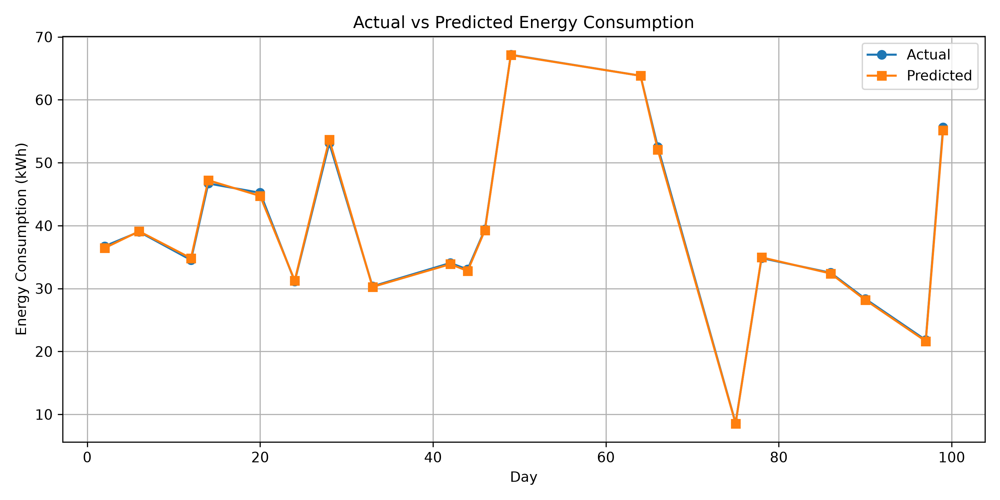
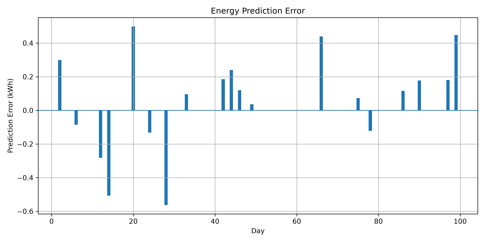

# Household Energy Consumption Prediction

A machine learning project that predicts daily household electricity consumption using historical usage patterns, voltage, and current readings — and estimates electricity bills based on those predictions.

## Overview

Household electricity usage fluctuates from day to day based on appliance usage, weather, and lifestyle patterns. This project explores whether a simple linear regression model can reliably predict a household's daily energy consumption using just three inputs: the previous day's consumption, average voltage, and average current.

Beyond prediction, the project includes a bill estimation tool that compares the electricity bill calculated from actual consumption against the bill calculated from predicted consumption — giving a practical sense of how accurate the model is in real terms (rupees, not just kWh).

## Dataset

The dataset consists of 100 days of household electricity consumption records, with the following fields:

| Field | Description |
|---|---|
| Day | Day number |
| Previous Day Energy Consumption (kWh) | Energy used the day before |
| Average Voltage (V) | Mean voltage recorded for the day |
| Average Current (A) | Mean current recorded for the day |
| Actual Energy Consumption (kWh) | Energy actually consumed that day |

Since the first day has no prior-day value to reference, that record is dropped before training, leaving 99 usable rows for the model.

## Approach

A **Linear Regression** model was trained using three features:

- Previous day's energy consumption
- Average voltage
- Average current

The target variable is the day's actual energy consumption. The dataset was split 80/20 into training and testing sets, and the model's predictions on the test set were evaluated against the true values.

## Results

The model was evaluated using four standard regression metrics:

| Metric | Result |
|---|---:|
| MAE | 0.20 kWh |
| RMSE | 0.24 kWh |
| R² Score | 0.9995 |
| MAPE | 0.58% |

These results reflect strong predictive accuracy on this dataset, though they are naturally tied to the specific data and model configuration used here.

### Visualizations

Two plots are generated to help interpret model performance:

**Actual vs. Predicted Energy Consumption** — visualizes how closely predictions track actual usage.



**Prediction Error** — shows the residual error across the test set.



## Electricity Bill Calculator

Once predictions are generated, the program lets you estimate an electricity bill for a custom time period — for example, 10, 30, 60, or 90 days.

For the selected period, it calculates:

- Total actual energy consumption
- Total predicted energy consumption
- Estimated bill based on actual consumption
- Estimated bill based on predicted consumption
- The difference between the two bills

Bill amounts are computed using the tariff rates defined within the project.

### Example Output

For a 30-day period, the model produced:

- Actual consumption: 1203.38 kWh
- Predicted consumption: 1204.62 kWh
- Actual estimated bill: ₹6,236.32
- Predicted estimated bill: ₹6,244.12
- Difference: ₹7.80

*(Note: these numbers will vary depending on the dataset and model used.)*

## Project Structure

\```text
energy-consumption-prediction/
│
├── code/
│   └── energy_prediction.py
│
├── data/
│   └── energy_100_days_dataset.csv
│
├── graphs/
│   ├── actual_vs_predicted.png
│   └── prediction_error.png
│
├── results/
│   ├── model_metrics.txt
│   └── prediction_results.csv
│
└── README.md
\```
